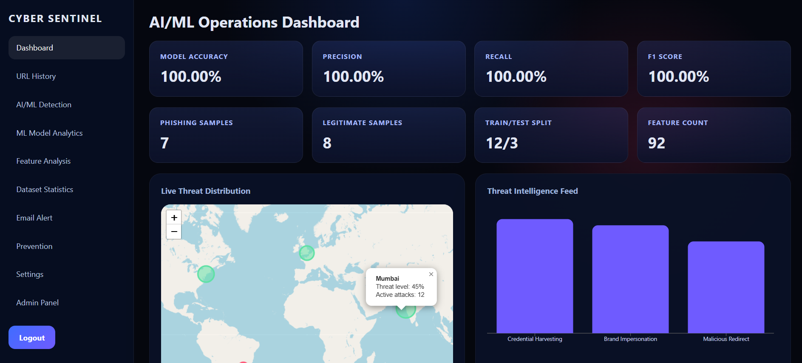
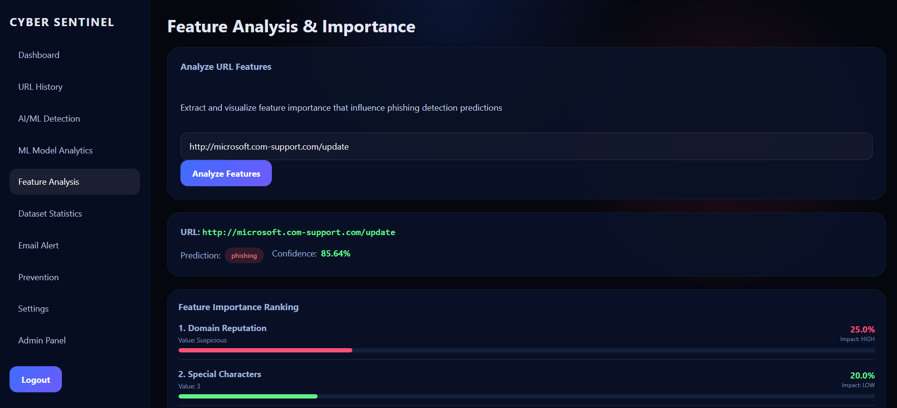
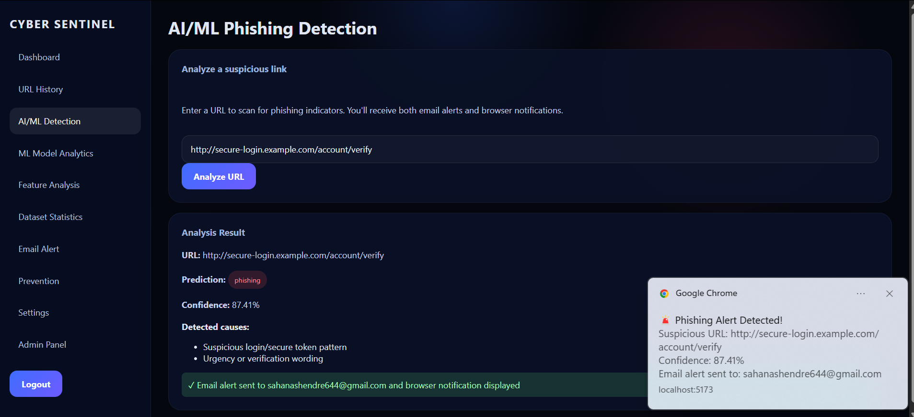
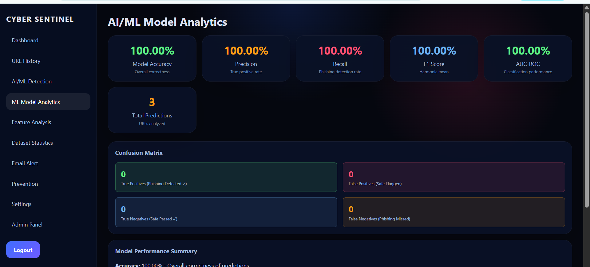
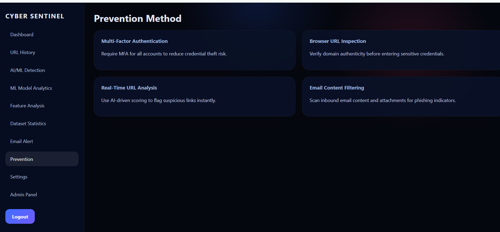
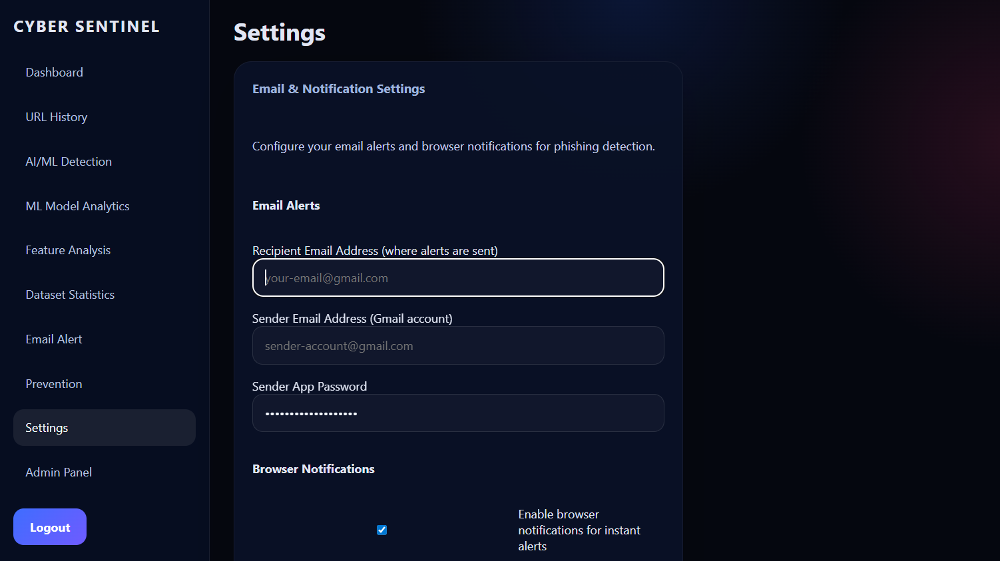
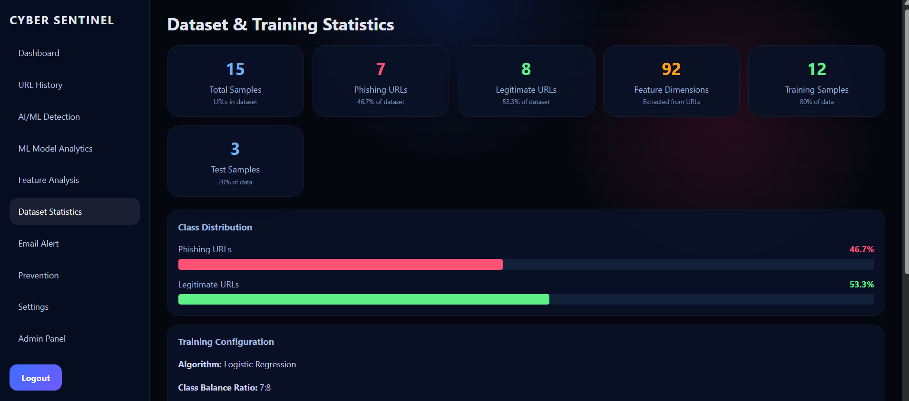
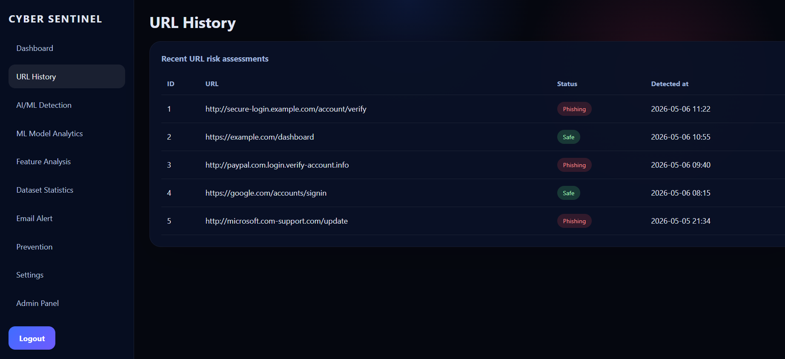

# Real-Time AI/ML-Based Phishing Detection and Prevention System

## 📌 Overview
This project is a **real-time phishing detection and prevention system** built using **Artificial Intelligence (AI)** and **Machine Learning (ML)**.  
It aims to protect users against phishing attacks by analyzing emails, URLs, and metadata, then generating alerts and prevention strategies through an interactive dashboard.

Developed as part of an **AI/ML internship team project**, this system demonstrates how machine learning can be applied to cybersecurity challenges.

---


## 🗂 Project Structure

---

AIML PHISHING_PROJECT/
│
├── backend/                # Python backend (AI/ML + API)
│   ├── app.py              # Main backend application
│   ├── model.py            # ML model integration
│   ├── email_service.py    # Email alert service
│   ├── data/               # Dataset storage
│   ├── requirements.txt    # Python dependencies
│   ├── .env                # Environment variables
│   └── venv/               # Virtual environment
│
├── frontend/               # React + TypeScript frontend
│   ├── src/
│   │   ├── components/     # Reusable UI components
│   │   ├── pages/          # Application pages (Dashboard, Alerts, Analytics)
│   ├── App.tsx             # Root React component
│   ├── api.ts              # API integration
│   ├── styles.css          # Global styles
│   ├── package.json        # Node.js dependencies
│   └── tsconfig.json       # TypeScript configuration
│
├── dataset.csv             # Training dataset
├── phishing_model.pkl      # Trained phishing detection model
├── vectorizer.pkl          # Text vectorizer for ML
├── phishing_report.xlsx    # Report of phishing detection results
└── README.md               # Project documentation


---


## 🖼️ Screenshots / Output

Here are some screenshots of the system in action:

- **Dashboard**  
  

- **Feature Analysis**  
  

- **Phishing Detection**  
  

- **ML Analytics**  
  

- **Prevention Page**  
  

- **Settings Page**  
  

- **Statistics Page**  
  

- **History Page**  
  


---

## ⚙️ Features
- **AI/ML Backend**
  - Real-time phishing detection using trained ML models
  - Email alert service with SMTP/MailHog integration
  - REST API for frontend communication
  - Model training pipeline (`train_model.py`)

- **Frontend Dashboard**
  - Real-time phishing alerts
  - Dataset statistics and analytics
  - Admin panel for managing alerts
  - Prevention strategies and visualization

---

---

## 🚀 Getting Started

### Prerequisites
- **Python** 3.9+
- **Node.js** 18+
- **npm** or **yarn**
- Recommended: **MailHog** for email testing

### Backend Setup
```bash
cd backend
python -m venv venv
source venv/bin/activate   # On Windows: venv\Scripts\activate
pip install -r requirements.txt
python app.py

```

### Frontend Setup

```bash
cd frontend
npm install
npm run dev

```
---

---
### 📊 Tech Stack

Backend: Python, Flask, scikit-learn, pandas

Frontend: React, TypeScript, Vite

Database: CSV dataset + pickle models

Email Service: SMTP / MailHog

### 📈 Workflow

Collect dataset of phishing and legitimate emails.

Train ML model (train_model.py) using vectorization + classification.

Save trained model (phishing_model.pkl) and vectorizer (vectorizer.pkl).

Backend serves predictions via API (app.py).

Frontend dashboard displays alerts, analytics, and prevention strategies.

---
---

### 🛡️ Future Scope

Integration with Gmail/Outlook APIs for real-world email scanning

Real-time phishing URL detection

Deployment with Docker & Kubernetes

Advanced visualization with charts and graphs

Deep learning models for improved accuracy

### 👨‍💻 Team Members

Member 1: SAHANA K SHENDRE

Member 2: MANSI MAJUKAR

Member 3: SIMRAN KURANGI

Member 4: SUPRIYA NILAJKAR

### 📄 License

This project is licensed under the MIT License.


---

✨ This version highlights that it’s a **team effort**, with clear roles for each member. You can fill in the names and responsibilities to match your actual contributions.  

Would you like me to also add a **“Results & Evaluation” section** (with placeholders for accuracy, precision, recall, F1-score) so your team can showcase the model’s performance metrics in the README? That would make it look even stronger for internship or portfolio use.


